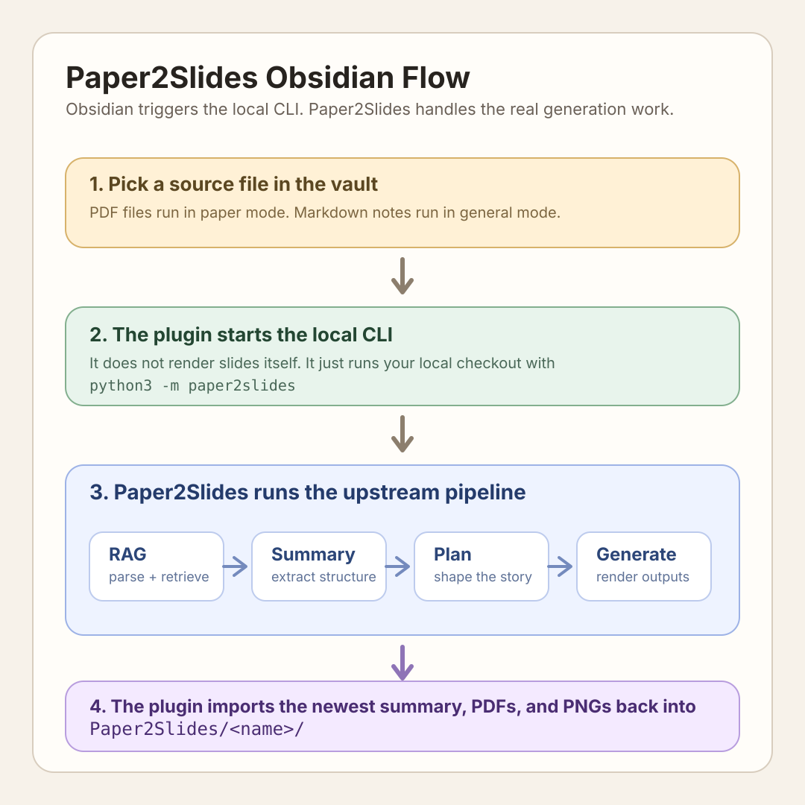

# Paper2Slides for Obsidian

An Obsidian desktop plugin for running [Paper2Slides](https://github.com/HKUDS/Paper2Slides) from inside your vault and pulling the latest outputs back in.

This plugin does not generate slides on its own. It connects Obsidian to a local `Paper2Slides` checkout, starts the upstream CLI, tracks the run, and imports the newest results into your vault.

## What you get

- Settings tab inside Obsidian
- Ribbon button for the current file (generate and lend/share)
- Right-click menu on PDFs and Markdown notes
- Command palette actions for generate, lend, re-import, setup check, and stop
- Real generation options instead of hardcoded defaults
- Provider overrides for Z.AI, LM Studio, Ollama, and AnythingLLM
- Provider health checks and model loading for local endpoints
- Run logs saved into the imported output folder
- **Lend/share functionality** for easy distribution of generated slides and posters

## Use it in a minute

1. Get the original `Paper2Slides` repo running on your machine
2. Make sure its Python dependencies, API keys, and `.env` are in place
3. Build this plugin and drop it into `.obsidian/plugins/paper2slides-obsidian/`
4. Open the plugin settings in Obsidian
5. Set:
    - `Python command`, usually `python3`
    - `Paper2Slides repo path`, pointing to your local checkout
    - `API provider`, if you want to override the repo defaults
    - any generation defaults you want
    - lending preferences (format, QR codes, optimization, etc.)
6. Trigger it from one of these places:
    - the ribbon button (generate or lend)
    - the command palette
    - the right-click menu on a PDF or Markdown note
7. Open `Paper2Slides/<source-file-name>/` in the vault after the run finishes
8. Use the lend/share features to distribute your generated content

## Lend/Share Feature

The lend feature allows you to easily share your generated slides and posters with others:

- **One-click sharing** from ribbon, context menu, or command palette
- **Multiple export formats**: HTML (web-viewable), PDF, PNG images, or ZIP archives
- **QR code generation** for easy scanning and sharing in person
- **Smart optimization** to reduce file sizes while maintaining quality
- **Summary inclusion** to provide context with your shared presentations
- **Sharing history** to track what you've lent and when

## Actual workflow

- PDFs run in `paper` mode
- Markdown notes run in `general` mode
- The plugin starts `python3 -m paper2slides`
- `Paper2Slides` handles parsing, summary, planning, and generation
- The plugin imports the newest summary, PDFs, PNGs, and `last-run.log` back into the vault
- **Lend feature** exports generated outputs in shareable formats with optional QR codes

## In-app controls

- **Settings tab**:
  - Python path, repo path, API provider, provider-specific endpoint and model settings
  - Output type, slides length, poster density, style, custom style prompt
  - Fast mode, parallel workers, import root, save run log
  - **Lend settings**: enable feature, default format, include summary, optimize sharing, generate QR code, open after export, history limit
- **Ribbon button**:
  - **Generate** for the active PDF or Markdown note (presentation icon)
  - **Lend/Share** for the active PDF or Markdown note (share icon)
- **Right-click menu**:
  - Generate or re-import the latest outputs for a file
  - Lend/Share the latest outputs for a file
- **Command palette**:
  - Generate, lend, re-import, check setup, stop current run
  - Refresh provider models, test selected provider

## Setup notes

1. Clone the original `Paper2Slides` repo
2. Install its dependencies
3. Configure `paper2slides/.env`
4. Run `npm install`
5. Run `npm run build`
6. Copy `manifest.json`, `main.js`, and `versions.json` into `.obsidian/plugins/paper2slides-obsidian/`
7. Enable the plugin in Obsidian
8. Run `Check Paper2Slides setup` once before the first real job
9. Configure lend settings in the plugin preferences

## Provider overrides

If you do not want to rely on the upstream repo defaults, you can override the LLM endpoint directly in the plugin:

- `Z AI`
  - uses the International Coding Plan endpoint and lets you set the API key plus a model such as `glm-5.1`
- `LM Studio`
  - uses a local OpenAI-compatible endpoint, defaulting to `http://127.0.0.1:1234/v1`
- `Ollama`
  - uses a local OpenAI-compatible endpoint, defaulting to `http://localhost:11434/v1`
- `AnythingLLM`
  - lets you point Paper2Slides at your local AnythingLLM endpoint and model setup

For `LM Studio`, `Ollama`, and `AnythingLLM`, the settings tab can now test the endpoint and try to load the available model list directly.

## Credit

This repo only covers the Obsidian side of the workflow.

- Original project: [HKUDS/Paper2Slides](https://github.com/HKUDS/Paper2Slides)
- The actual slide generation pipeline lives there
